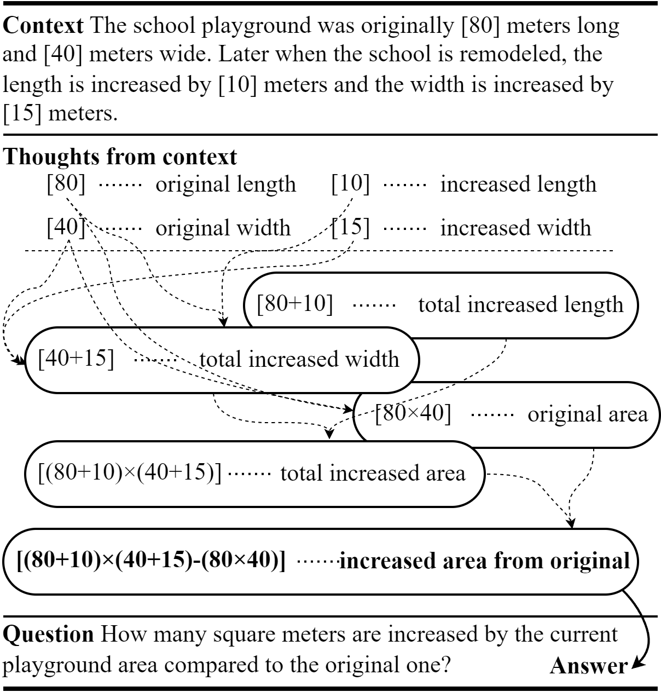

# ATHENA for Mathematical Reasoning

**ATHENA** (**A**ttention-based **TH**ought **E**xpansion **N**etwork **A**rchitecture) is a neural architecture of thought expansion for mathematical reasoning.

Link to our [paper]()

<p align=center>

</p>

## Results

| Model                      | MAWPS | ASDIV-A | Math23k | SVAMP | UnbiasedMWP | SVAMP (1:N) | UnbiasedMWP (1:N) |
|----------------------------|-------|---------|---------|-------|-------------|-------------|-------------------|
| **ATHENA (RoBERTa-base)**  | 92.2  | 86.4    | 84.4    | 45.6  | 36.2        | 52.5        | 35.4              |
| **ATHENA (RoBERTa-large)** | 93.0  | 91.0    | 86.5    | 54.8  | 42.0        | 67.8        | 48.4              |


## Datasets

Our repository includes with following datasets:

- [MAWPS](https://aclanthology.org/N16-1136)
- [ASDiv](https://aclanthology.org/2020.acl-main.92)
- [SVAMP](https://aclanthology.org/2021.naacl-main.168)
- [Math23k](https://aclanthology.org/D17-1088/)  
- [MathQA](https://aclanthology.org/N19-1245/)


## Run Model
### Install Environments
- Python : 3.9
- Requirements
```
pip install -r requirements.txt
```

### Pre-download Language Models
We recommend to prepare language models before training.
```
python main.py download --language-model=roberta-base
```

### Training
We offer various options for training.
List of arguments can be found in [`train()` in `main.py`](https://github.com/the-jb/athena-math/blob/main/main.py#L32).

The following shows few examples:

- Training dataset
```
python main.py train --dataset=asdiv-a
```

- Training with fixed seed
```
python main.py train --dataset=asdiv-a --seed=100
```

- Training with specific GPU
```
python main.py train --gpu=0 --dataset=asdiv-a
```
> The code does support distributed training with multiple GPUs.

### Default path

- Dataset : `data`
- Logs : `logs`
- Checkpoints : `ckpts`
- Results (for the best score record) : `results`
- Outputs (for the prediction outputs): `outputs`
- Language Models : `.language-models`

### Test models

```
python main.py test --model-path="ckpts/<ckpt_path>/<ckpt_filename>.ckpt" \
                    --hparam-path="logs/<log_path>/hparams.yaml" \
                    --dataset=svamp
```

### Inspect Dataset

```
python main.py inspect-data --dataset=cv_asdiv-a/fold0
```

# Citation
> To be updated
```

```
